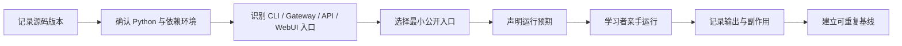

# NanoBot 第 00 章：建立运行基线

## 学习状态

| 项目 | 内容 |
|---|---|
| 状态 | 未开始 |
| Source Commit | `9807e9cf37a5f5dcfad9dd86276dbda56e5363da` |
| 项目版本 | `0.3.0` |
| 首次学习日期 |  |
| 完成日期 |  |

## 1. 本章核心问题

- 我正在学习的是哪个确定版本，而不是哪个模糊的“最新 NanoBot”？
- NanoBot 有哪些公开入口，它们最终启动的是同一个 Agent Core 吗？
- 在不阅读内部实现前，我能观察到哪些输入、输出、持久化和常驻进程？
- 以后如何判断学习实验改变了行为，还是环境本身没有准备好？

## 2. 宏观流程



## 3. 本章黑盒边界

本章需要理解：

- 仓库版本、项目版本、Python 版本和依赖环境是不同概念。
- CLI、Gateway、API、WebUI 是公开入口，而不是四套 Agent Core。
- 一次可靠源码学习必须能说明基线和复现条件。

本章暂时不展开：

- `AgentLoop` 内部如何处理消息。
- Provider 如何发送模型请求。
- Tool、Session、Memory 和 Channel 的具体实现。

## 4. 观察入口

| 入口 | 用户看到什么 | 当前只观察什么 |
|---|---|---|
| `nanobot agent` | 终端交互/单次消息 | 启动、输入、最终输出、Session 副作用 |
| `nanobot gateway` | 常驻服务 | 启动的服务、端口、关闭行为 |
| `nanobot serve` | OpenAI-compatible API | HTTP 边界与健康状态 |
| `nanobot webui` | 浏览器界面 | WebUI 与 Gateway/WebSocket 的关系 |

## 5. 建议观察顺序

正式执行前，先根据 [[../learning-protocol]] 用自己的话说明预期。命令由学习者亲手输入。

### A. 记录只读版本信息

```bash
git status --short
git rev-parse --abbrev-ref HEAD
git rev-parse HEAD
python --version
```

### B. 识别项目入口和依赖声明

阅读：

- `pyproject.toml`
- `nanobot/__main__.py`
- `nanobot/cli/entry.py`
- `nanobot/cli/commands.py`
- `README.md` 的 Quick Start

### C. 选择一个最小运行入口

如果本机已经配置 Provider，可观察一次 one-shot：

```bash
nanobot agent -m "Hello"
```

如果尚未配置 Provider，本章不要求申请 API Key。可以只观察 CLI help、配置加载或使用项目
现有 Mock 测试建立基线。

### D. 运行最接近核心入口的测试

从测试目录中选择一个快速、无外部凭据的测试；先说明它应证明什么，再执行。不要在本章
追求完整测试套件通过。

## 6. 基线记录

### 环境

| 项目 | 实际值 |
|---|---|
| 本地路径 | `/Users/comet/WorkSpace/Project/Python/nanobot` |
| Git branch |  |
| Git commit |  |
| NanoBot version |  |
| Python version |  |
| 包管理/虚拟环境 |  |
| Provider 是否配置 |  |

### 公开入口观察

| 入口 | 我的预期 | 实际观察 | 文件/状态副作用 |
|---|---|---|---|
| CLI |  |  |  |
| Gateway |  |  |  |
| API |  |  |  |
| WebUI |  |  |  |

## 7. 脱稿验收

- [ ] 我能解释 Git commit 与 NanoBot package version 的区别。
- [ ] 我能说出 CLI、Gateway、API、WebUI 的用途。
- [ ] 我能指出 `nanobot` 命令的 Python entry point。
- [ ] 我记录了一个可重复的最小运行或测试基线。
- [ ] 我没有在本章提前进入 Agent Loop 细节。

### 一句话骨架

`一句话骨架：源码学习的运行基线是……，如果缺少它，最大的风险是……`

## 8. 相关源码与笔记

- [[../quickstart]]
- [[../roadmap]]
- [[../source-map]]
- `pyproject.toml`
- `nanobot/cli/entry.py`
- `nanobot/cli/commands.py`

## 9. 为什么这样设计

### 为什么第 00 章不直接讲 Agent Loop

没有版本和运行基线时，后续看到的异常无法区分是代码设计、配置差异、依赖差异还是源码
已经更新。先固定观察坐标，才能让后续实验具有可证伪性。

### 为什么只选一个最小入口

CLI、Gateway、API 和 WebUI 最终共享大量运行时能力。第一章同时配置四个入口会把环境问题
误当成架构问题；先建立一个最小成功路径，之后再比较入口差异。

### 为什么不要求一开始跑完整测试套件

完整测试混合了核心、Channel、可选依赖和前端边界。学习基线需要的是快速反馈和可重复
观察，不是一次性证明整个仓库正确。

## 10. 本章涉及的核心元能力

### 可复现性

使用源码 commit、项目版本、解释器版本和环境信息描述一个确定的软件状态。

### 控制变量

每次只改变一个入口或配置，避免把多个变量共同造成的现象归因给错误模块。

### 黑盒观察

在阅读实现之前，先从公开接口、输入、输出和副作用建立行为模型，再用源码解释现象。

### 基线思维

调试和性能分析都需要可比较的基线；源码学习本质上也是不断提出假设并比较证据。

