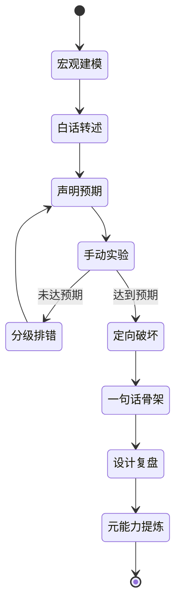

# NanoBot 源码学习协议

本协议继承 [[AI辅助编码后自主研读代码学习规范]] 的核心原则：AI 负责暴露思考痕迹、
控制提示等级和设计实验，学习者负责亲自执行、预判、转述和总结。

## 1. 角色边界

### 学习者

- 亲手输入正式学习中的命令和代码。
- 执行前说明预期。
- 用自己的语言转述数据流和副作用。
- 在跑通后完成定向破坏实验。
- 用一句话概括核心约束。

### AI

- 给出宏观图、源码导航、问题和实验设计。
- 代码示例超过 10 行时，为关键决策写 `# WHY:` 注释。
- 不用标准答案替代学习者的第一次思考。
- 按方向、位置、答案三个等级释放提示。
- 每章最后讲解设计原因与核心元能力。

> [!NOTE]
> “学习者亲手执行”适用于正式章节的源码学习和实验。整理笔记、生成模板、维护索引等
> 知识库管理工作可以由 AI 执行。

## 2. 每章学习状态机



## 3. 每章三次学习块

### 学习块 A：宏观与观察，90 分钟

- 回忆上一章，不打开笔记。
- 阅读 Mermaid 图和本章核心问题。
- 运行或观察最小公开入口。
- 只追踪 Happy Path。
- 写下暂时保持黑盒的模块。

### 学习块 B：源码与测试，90 分钟

- 从接口进入实现，不按文件从头读到尾。
- 追踪一个正常路径和一个异常路径。
- 阅读最接近的测试，辨认受保护的不变量。
- 记录所有权、输入、输出、状态和副作用。

### 学习块 C：修改与内化，90 分钟

- 做一个范围很小的代码实验。
- 修改前声明预期。
- 跑通后进行一次定向破坏。
- 脱稿重画流程。
- 输出一句话骨架。
- 完成本章“为什么这样设计”和“核心元能力”。

## 4. 提示等级

| 触发词 | AI 可以提供 |
|---|---|
| `卡住了` | 只给概念或逻辑方向，不给文件和行号 |
| `请给位置` | 给出文件、类、方法或紧凑行号范围 |
| `请直接给答案` | 给出完整解释或修复方案 |

如果学习者没有先给出命令或实验的预期，先补充：

`预期：执行后应当……；可能产生的副作用是……`

## 5. 每章结束条件

### 必需产物

- 一张自己重画的 Mermaid 图。
- 一份关键调用链。
- 一个实验记录。
- 一次定向破坏记录。
- 一句话骨架。
- 一份学习日志。

### 解锁标准

以下五项至少满足四项：

- 能脱稿画流程。
- 能解释模块边界。
- 能定位需求所有者。
- 能使用测试验证理解。
- 能完成小修改并预测影响。

## 6. 耐心协议

- WIP 永远为 1：一次只学一章。
- 状态不好时执行 20 分钟最低学习量。
- 未完成的章节继续，不重开，不追回“落后周数”。
- 每次结束前写下一个五分钟内可以启动的下一动作。
- 新问题先进入 [[progress#好奇心停车场|好奇心停车场]]。
- 连续学习两个新章节后，至少安排一次纯回忆学习块。
- 使用 D+1、D+7、D+30 主动回忆，而不是反复重读。

## 7. 源码与笔记仓库边界

- NanoBot `main` 用于跟随上游，不保存个人笔记。
- 代码实验使用短期 `study/chXX-topic` 分支。
- 本知识库保存所有图、笔记、实验预期、结果和复习记录。
- 每章记录 commit；源码更新时先判断本章调用链是否变化，再决定是否更新笔记。
- 可贡献的实验重新整理为干净分支，不直接提交学习过程中的破坏代码。

## 8. AI 协作提示词

开始章节：

```text
开始 NanoBot 第 XX 章。遵守 [[NanoBot 源码学习协议]]：
先给本章问题、Mermaid 宏观图、黑盒边界和第一组观察任务，不要一次讲完。
```

继续章节：

```text
继续 NanoBot 第 XX 章。这是我的转述、预期和观察结果：……
请检查理解，但只按协议允许的等级提示。
```

结束章节：

```text
这是我的一句话骨架：……
请按解锁标准验收，并指出需要进入 D+1 复习的问题。
```

