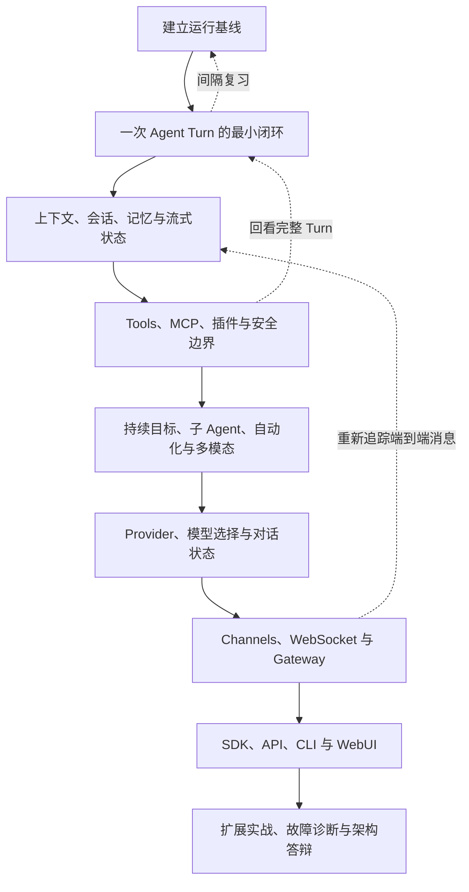

# NanoBot 学习导读

## 1. 为什么学习 NanoBot

NanoBot 是一个使用 Python 编写的开源 Agent 框架。与 OpenCode、Codex、Pi Agent
相比，它更适合作为 Python 开发者理解 Agent Runtime 的源码入口：核心循环、工具、
会话、记忆、Provider、Channel、自动化、API、CLI 和 WebUI 都能在同一仓库中观察。

学习顺序采用“主干先行、能力外扩、显示层收尾”：先理解一次 Agent Turn，再沿着真实
调用链扩大能力边界，最后学习 CLI 和 WebUI 如何呈现内部状态。

> [!IMPORTANT]
> 不要从 2411 行的 `AgentLoop` 开始逐行硬啃。第一站是“一次 Agent Turn 的纵向
> 切片”，先把 Bus、Loop、Runner、Provider、Tool、Session 和 Channel 串起来。

## 2. 完整学习路线

当前学习基线是 NanoBot `0.3.0`、`main@9807e9cf`。本地快照中，Python 非测试代码
约 10.9 万行，Python 测试约 3.7 万行，WebUI TypeScript/TSX 约 9.4 万行。因此，
44 周的稳定学习不是拖延，而是对项目规模的诚实估计。

## 3. 44 周阶段概览

| 周期 | 内容 | 阶段成果 |
|---|---|---|
| 第 1～6 周 | 运行基线、一次 Turn、Bus、Loop、Runner、Mini Agent | 独立重写最小 Tool Calling Agent |
| 第 7 周 | 第一次复习 | 脱稿画图并修复一个故意错误 |
| 第 8～13 周 | Context、Templates、Session、Compaction、Memory、Streaming | 回答“模型这次究竟看见了什么” |
| 第 14 周 | 第二次复习 | 完成 Session/Context 检视器 |
| 第 15～20 周 | Tool、文件、Shell、Web、MCP、Plugin、Subagent | 完成一个带安全边界的自定义 Tool |
| 第 21～23 周 | Goal、Cron、Trigger、Automation、多模态 | 让任务跨轮次、跨时间运行 |
| 第 24 周 | 第三次复习 | 用状态机解释恢复与投递语义 |
| 第 25～28 周 | Config、Model Runtime、Provider、Fallback | 同一脚本切换两个 Provider |
| 第 29～34 周 | Channel、WebSocket、Gateway、Pairing | 完成客户端和 Channel 能力矩阵 |
| 第 35 周 | 第四次复习 | 端到端追踪任意 Channel 消息 |
| 第 36～41 周 | SDK、API、CLI、WebUI、构建与安全审计 | 从四种入口追踪同一个请求 |
| 第 42～44 周 | 扩展、故障诊断、架构答辩 | 达到可修改、可维护的掌握程度 |

逐章内容和周次见 [[roadmap]]，勾选状态见 [[progress]]。

## 4. “学完整”的定义

“完整”不等于给所有文件分配相同阅读时间，而是分三种深度。

### 一级：逐行理解

- `nanobot/bus/`
- `nanobot/agent/loop.py`
- `nanobot/agent/runner.py`
- Context、Session、Memory 与 Compaction
- Tool 框架
- Workspace、Shell 和网络安全边界

### 二级：代表实现深读

- Provider：深读 OpenAI Compatible、Responses、Anthropic，再比较其余实现。
- Channel：深读 WebSocket、普通 Bot、企业 Channel、长连接设备 Channel 各一个。
- Tool：每个能力家族至少深读一个，并亲自扩展一个。

### 三级：全部建立能力矩阵

所有 Provider 都记录 API、鉴权、Streaming、Tool Call、Reasoning、Conversation State、
Retry/Fallback 与多模态差异。所有 Channel 都记录连接方式、入站、出站、Streaming、
Media、鉴权、Pairing、Retry、平台限制和测试位置。

这种方式覆盖全部能力，同时尊重 NanoBot “允许适配器局部重复、核心保持小型”的设计
约束。

## 5. 每章固定教学结构

每章都必须包含：

1. 本章要解决的核心问题。
2. 一张 Mermaid 宏观流程图。
3. 本章暂时作为黑盒的部分。
4. 最小可运行路径。
5. 从接口、主路径到异常路径的源码阅读。
6. 对应测试如何证明行为。
7. 一个可观察实验。
8. 一个小型修改练习。
9. 脱离源码的转述和验收。
10. **为什么这样设计**。
11. **本章涉及的核心元能力**。

最后两个部分固定保留，且“核心元能力”是每章最后一节。正式章节从
[[templates/chapter-template]] 创建。

## 6. 耐心与延迟满足机制

每周固定三个 90 分钟学习块：

- 第一块：宏观图、运行观察和主路径追踪。
- 第二块：关键实现与对应测试。
- 第三块：小改动、测试和脱稿讲解。

状态不好时只完成 20 分钟的最低学习量，不补课、不加倍、不从第一章重新开始。

每章只有满足以下五项中的四项才解锁下一章：

- 能脱稿画出流程。
- 能解释模块责任边界。
- 能指出一个需求应该修改哪个模块。
- 能运行或编写相关测试。
- 能完成一个小修改并预测影响。

另外遵守四条规则：

1. 同时只学习一个章节，旁支问题写进“好奇心停车场”。
2. 每次结束时留下一个明确的下一步。
3. 在第 1、7、30 天各进行一次主动回忆。
4. 错过一周后从最近的图和验收题恢复，绝不从头重来。

## 7. 仓库策略

采用“Knowledge Base 为主、NanoBot 学习分支为辅”：

- 本目录保存路线、笔记、图、复习记录和能力矩阵，并提交到个人知识库仓库。
- NanoBot 源仓库的 `main` 只负责跟随上游。
- 代码实验使用 `study/chXX-topic` 一类短期分支，笔记不提交到 NanoBot 仓库。
- 每章在 [[source-map]] 中记录学习时对应的上游 commit，防止源码更新造成认知漂移。
- 如果实验有真实贡献价值，再单独整理为可提交上游的干净分支。

## 8. 如何开始

1. 打开 [[progress]]，填写本周可投入时间。
2. 阅读 [[learning-protocol]]，确认学习时的执行权与提示等级。
3. 开始 [[chapters/00-建立运行基线]]。
4. 每次学习后，从 [[templates/learning-note-template]] 创建日志。
5. 到复习周时，从 [[templates/review-template]] 创建复习记录。

后续与 AI 协作时，可以直接使用：`开始 NanoBot 第 00 章`、`继续 NanoBot 第 03 章`、
`NanoBot 学习：卡住了`、`请给位置` 或 `请直接给答案`。

