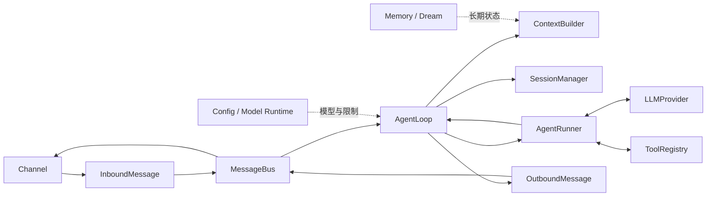

# NanoBot 源码地图与版本锚点

## 当前学习基线

| 项目 | 值 |
|---|---|
| Upstream | `https://github.com/HKUDS/nanobot` |
| 本地源码 | `/Users/comet/WorkSpace/Project/Python/nanobot` |
| 分支 | `main` |
| Commit | `9807e9cf37a5f5dcfad9dd86276dbda56e5363da` |
| 项目版本 | `0.3.0` |
| 锚定日期 | `2026-08-23` |

固定版本源码链接前缀：

`https://github.com/HKUDS/nanobot/blob/9807e9cf37a5f5dcfad9dd86276dbda56e5363da/`

## 一次 Turn 的源码地图

## 核心导航

| 责任 | 入口文件 | 学习章节 |
|---|---|---:|
| 消息事件与队列 | `nanobot/bus/events.py`, `nanobot/bus/queue.py` | 01～02 |
| Channel-facing Turn | `nanobot/agent/loop.py` | 01、03 |
| Model-facing Tool Loop | `nanobot/agent/runner.py` | 01、04 |
| 上下文装配 | `nanobot/agent/context.py` | 06～07 |
| Session 持久化 | `nanobot/session/manager.py` | 08～09 |
| 长期记忆 | `nanobot/agent/memory.py` | 10 |
| Hook 与投递 | `nanobot/agent/hook.py`, `turn_hooks.py`, `turn_delivery.py` | 11 |
| Tool 契约与发现 | `nanobot/agent/tools/base.py`, `registry.py`, `loader.py` | 12 |
| 文件与 Shell | `nanobot/agent/tools/filesystem.py`, `shell.py`, `sandbox.py` | 13～14 |
| Web 与 SSRF | `nanobot/agent/tools/web.py`, `nanobot/security/network.py` | 15 |
| MCP 与插件 | `nanobot/agent/tools/mcp.py`, `nanobot/agent/plugins.py` | 16 |
| Subagent 与持续目标 | `nanobot/agent/subagent.py`, `tools/spawn.py`, `tools/long_task.py` | 17～18 |
| 自动化 | `nanobot/cron/`, `nanobot/triggers/` | 19 |
| 配置 | `nanobot/config/schema.py`, `loader.py`, `watcher.py` | 21 |
| Provider | `nanobot/providers/base.py`, `registry.py`, `factory.py` | 22～24 |
| Channel | `nanobot/channels/base.py`, `manager.py`, `registry.py` | 25～29 |
| WebSocket | `nanobot/channels/websocket/runtime.py` | 27 |
| Gateway | `nanobot/gateway/runtime.py`, `nanobot/cli/gateway_runtime.py` | 30 |
| SDK 与 API | `nanobot/sdk/`, `nanobot/api/server.py` | 31 |
| CLI 与命令 | `nanobot/cli/`, `nanobot/command/` | 32 |
| WebUI 连接层 | `webui/src/lib/nanobot-client.ts` | 33 |
| WebUI 状态投影 | `webui/src/hooks/useNanobotStream.ts` | 34 |
| WebUI 页面 | `webui/src/App.tsx`, `webui/src/components/` | 35 |

## 架构约束导航

- 项目架构：`docs/architecture.md`
- 核心保持小型：`.agent/design.md`
- Workspace、SSRF、Sandbox：`.agent/security.md`
- 原子写、Prompt、Windows 等陷阱：`.agent/gotchas.md`
- 贡献规范：`CONTRIBUTING.md`

## 版本更新记录

每次切换学习基线时追加，不覆盖历史。

| 日期 | 旧 Commit | 新 Commit | 影响章节 | 处理结果 |
|---|---|---|---|---|
| 2026-08-23 | — | `9807e9cf` | 初始基线 | 创建路线 |

