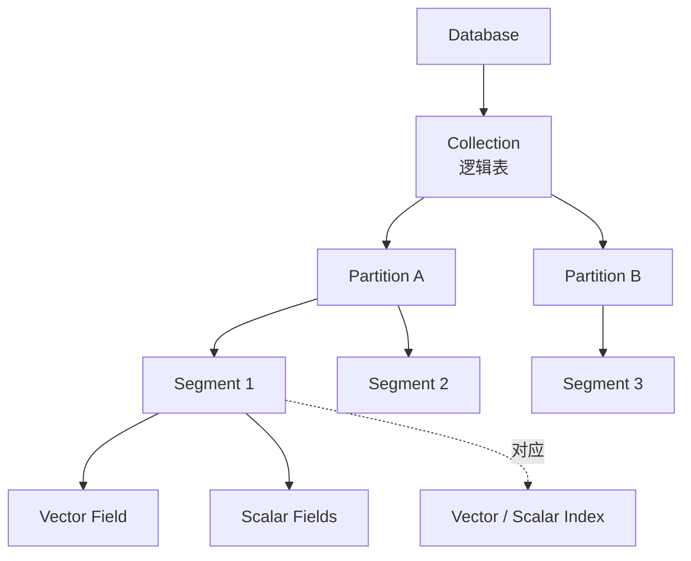
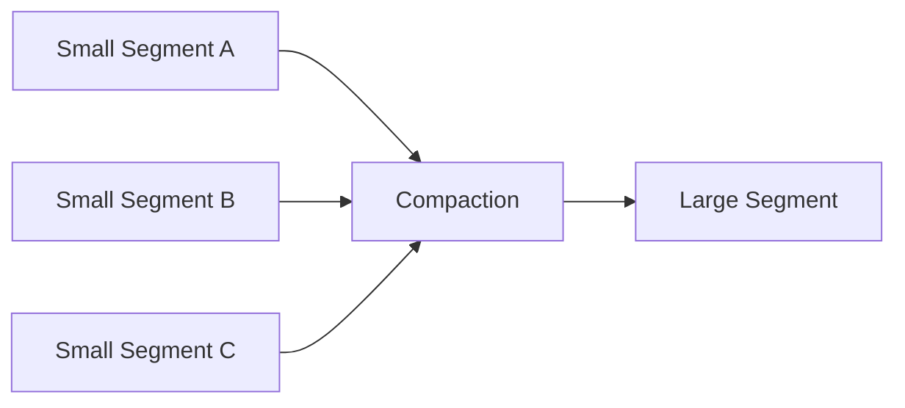
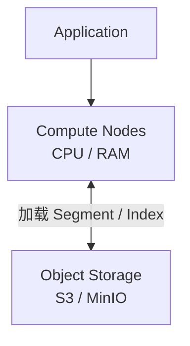
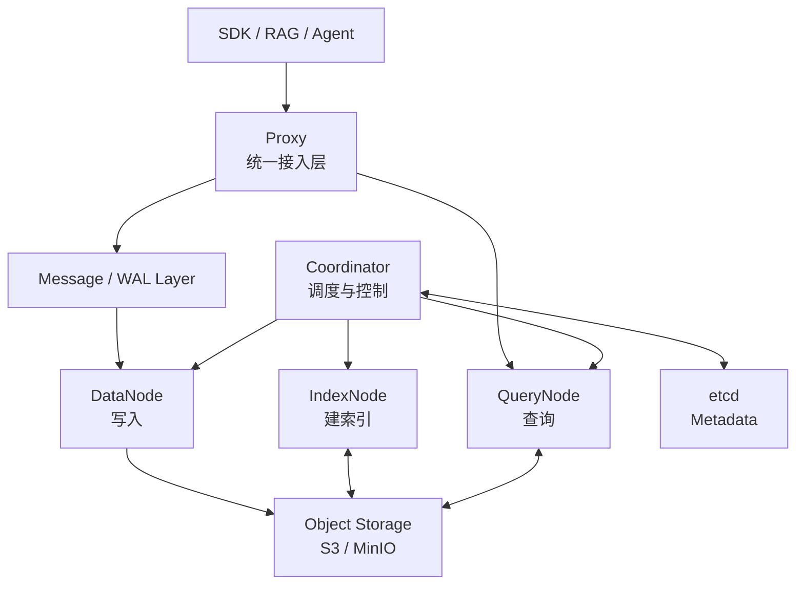
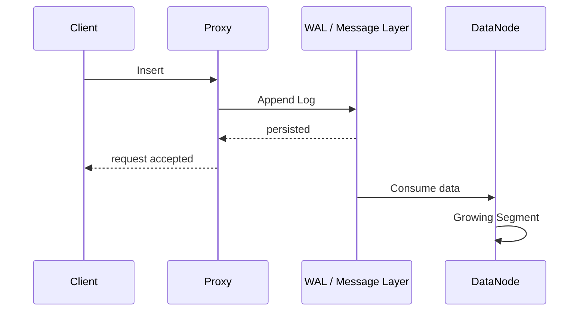
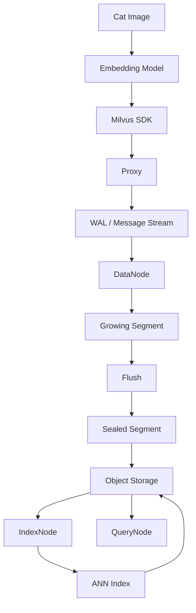
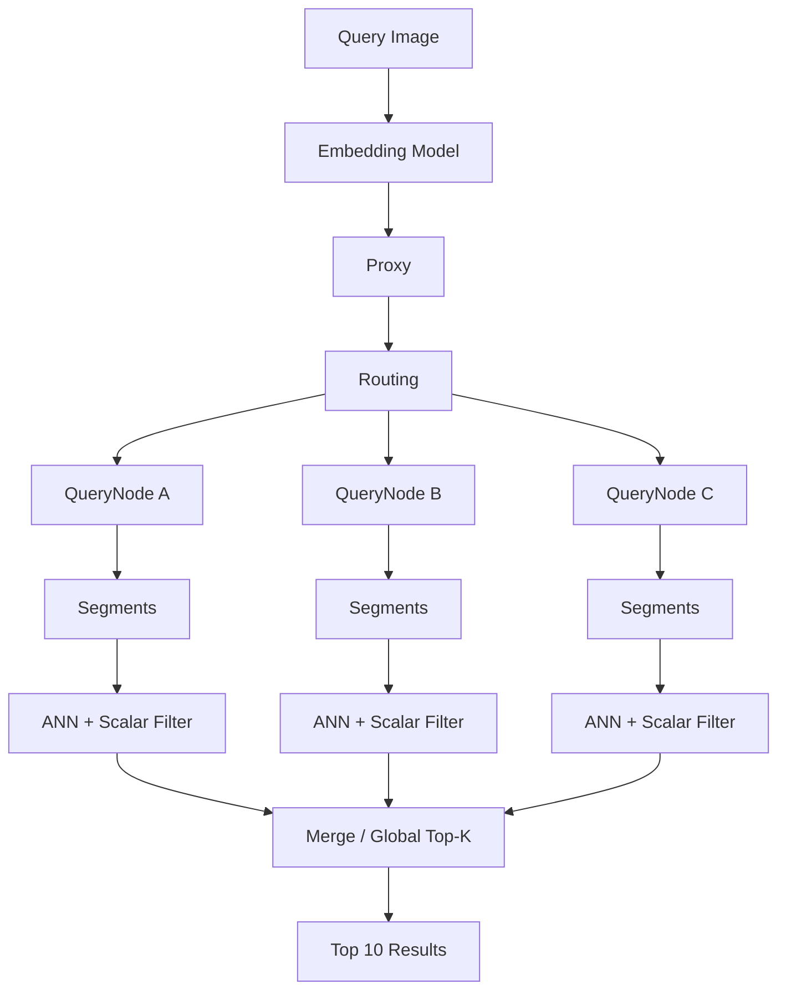
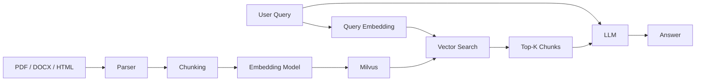
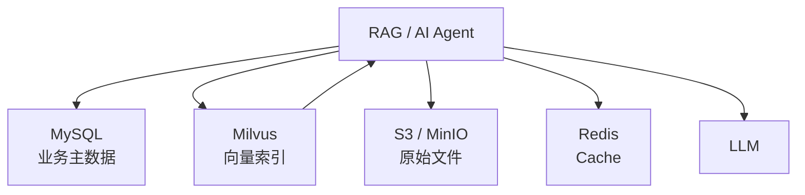
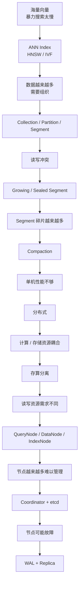

# Milvus 向量数据库笔记：从单机到分布式架构

> 本笔记基于原文本重新整理，重点关注 **Milvus 为什么存在、数据如何组织、Segment 生命周期、分布式架构以及完整读写链路**。  
> 部分实现细节进行了抽象，适合理解架构思想；具体组件名称和行为会随 Milvus 版本演进。

---

## 1. Milvus 是什么？

Milvus 是一个面向 **大规模向量数据存储与相似度检索** 的向量数据库。

可以把它理解成：

```text
Application / RAG / Agent
          ↓
        Milvus
          ↓
海量向量 + 标量数据
```

传统数据库擅长：

```sql
WHERE age > 18
AND category = 'landscape'
```

Milvus 除了这种标量过滤之外，还能做：

```text
从数亿个向量中，
找到距离 query_vector 最近的 Top-K 个向量。
```

因此典型场景包括：

- RAG 文档检索
    
- AI Agent 长期记忆
    
- 语义搜索
    
- 以图搜图
    
- 文搜图
    
- 推荐系统
    
- 音频相似度搜索
    
- 视频检索
    
- 多模态检索
    

---

# 2. 为什么需要向量数据库？

Embedding 模型可以把文本、图片、音频等转换为一个浮点数组：

```python
[
    0.032,
    -0.193,
    0.824,
    ...
]
```

例如一个 768 维 Embedding：

```text
文本
 ↓
Embedding Model
 ↓
[0.12, -0.39, ..., 0.73]
              768维
```

数学上，一个向量可以理解为：

> 高维空间中的一个点。

两个向量距离越近，通常意味着它们在 Embedding 模型所学习的语义空间里越相似。

例如：

```text
"Milvus 是什么？"
        ↓
Embedding

"Milvus 属于向量数据库"
        ↓
Embedding

两个向量距离较近
```

于是搜索问题变成：

> 给定一个 Query Vector，从 N 个向量中寻找距离最近的 K 个。

即：
$$TopK(q)=\operatorname{argmin}_{x_i} distance(q,x_i)  $$

---

# 3. 一条 Milvus 数据不仅只有向量

例如存储图片：

```text
id          = 10001
uploader    = "zhangsan"
category    = "meme"
aspect_ratio= "16:9"
created_at  = 2026-08-01
embedding   = [0.13, -0.42, ...]
```

可以分成两种字段。

### Vector Field

```text
embedding
```

负责：

```text
语义相似度搜索
```

### Scalar Field

例如：

```text
id
category
uploader
width
height
created_at
```

负责：

```text
过滤
排序
精确匹配
业务属性查询
```

所以一次典型检索可能是：

```text
category == "meme"
AND aspect_ratio == "16:9"
AND 找 embedding 最相似的 10 条
```

SQL 类比：

```sql
SELECT *
FROM images
WHERE category = 'meme'
  AND aspect_ratio = '16:9'
ORDER BY vector_distance(embedding, query_vector)
LIMIT 10;
```

Milvus 本质上同时处理了：

```text
标量查询
+
向量 ANN 查询
```

---

# 4. 为什么普通数据库索引不够？

传统标量：

```text
1
2
3
100
1000
```

天然可以比较：

```text
1 < 2 < 3 < 100
```

所以可以建立：

```text
B+ Tree
Bitmap
Inverted Index
```

但一个向量：

```text
[0.21, -0.13, 0.82, ...]
```

和另一个：

```text
[0.19, -0.11, 0.79, ...]
```

无法简单定义：

```text
vector A < vector B
```

真正需要的是：

```text
distance(A, B)
```

常见距离包括：

- L2 / Euclidean Distance
    
- Inner Product
    
- Cosine Similarity
    

如果有：

```text
100,000,000 个向量
```

每次查询都暴力计算：

```text
query × 1亿 vectors
```

成本太高。

因此产生了：

# ANN

Approximate Nearest Neighbor

即：

> 近似最近邻搜索。

牺牲极少量 Recall，换取数量级上的查询性能提升。

常见索引包括：

```text
HNSW
IVF_FLAT
IVF_PQ
IVF_SQ8
DiskANN
...
```

---

# 5. Milvus 的核心数据组织

Milvus 可以粗略理解为下面的层次：



核心关系可以记：

```text
Collection
    ↓
Partition
    ↓
Segment
    ↓
Fields / Rows
```

---

# 6. Collection 是什么？

Collection 类似传统数据库中的：

```text
Table
```

例如：

```text
images
documents
videos
audio
```

不同 Collection 可以拥有不同 Schema。

例如：

### images

```text
id
category
width
height
image_embedding: 1024维
```

### documents

```text
id
title
source
content
text_embedding: 1536维
```

因为不同 Embedding Model：

```text
维度不同
语义空间不同
用途不同
```

通常应该使用不同 Collection 或不同字段设计。

---

# 7. Partition 是什么？

Partition 是 Collection 内部的逻辑数据分区。

例如：

```text
images
├── meme
├── landscape
└── portrait
```

当查询明确知道只需要：

```text
meme
```

就可以避免搜索整个 Collection。

逻辑上相当于：

```text
Collection
    ↓
缩小搜索范围
    ↓
Partition
```

例如：

```python
search(
    collection="images",
    partition_names=["meme"]
)
```

从而减少需要访问的数据。

---

# 8. Segment 是什么？

Segment 是 Milvus 非常核心的内部数据组织单位。

可以把它理解成：

> 一批已经组织好的列式向量与标量数据。

例如一个 Segment：

```text
Segment 001

id:
[1,2,3,4,...]

category:
["meme","meme","landscape",...]

width:
[1920,1280,1920,...]

embedding:
[
   vector1,
   vector2,
   vector3,
   ...
]
```

概念上可以理解为：

```text
Segment
├── Vector Fields
├── Scalar Fields
└── Index Metadata / Index Files
```

---

# 9. 为什么 Segment 需要 Growing 和 Sealed？

如果一个 Segment 同时：

```text
不断写入
+
不断更新索引
+
不断接受查询
```

会导致严重的读写竞争。

因此 Milvus 采用类似：

```text
Mutable
→
Immutable
```

的思想。

## Growing Segment

正在接收数据：

```text
可写
可查询
通常还没有完整 ANN 索引
```

## Sealed Segment

数据写满或触发 Flush 后：

```text
不可再追加写入
数据固化
可以建立 ANN 索引
主要负责查询
```

---

# 10. Segment 生命周期


核心设计思想：

```text
新数据
↓
Growing Segment

旧数据
↓
Sealed Segment + Index
```

即：

> 新 Segment 负责写，旧 Segment 负责高性能读。

---

# 11. Compaction 是什么？

不断写入数据以后可能产生：

```text
Segment 1   10MB
Segment 2   15MB
Segment 3   8MB
Segment 4   20MB
...
```

大量小 Segment 会产生：

- 元数据膨胀
    
- 查询需要扫描更多 Segment
    
- 存储碎片
    
- 删除数据留下碎片
    
- 查询调度复杂度增加
    

于是需要进行：

# Compaction

把多个较小 Segment 合并：

```text
Segment A
Segment B
Segment C
    ↓
Compaction
    ↓
Segment D
```



类似很多 LSM / 列存 / 分布式数据库中的后台整理思想。

---

# 12. 单机 Milvus 可以怎么理解？

最简单的 Milvus 可以抽象成：

```text
Application
     ↓
 Milvus Process
     ↓
Collection
     ↓
Partition
     ↓
Segment
     ↓
Index
```

如果所有功能：

```text
写入
查询
索引构建
元数据管理
存储
```

都放在一台服务器：

```text
                 ┌───────────────┐
Client ─────────▶│    Milvus     │
                 │               │
                 │ Insert        │
                 │ Search        │
                 │ Index         │
                 │ Storage       │
                 │ Metadata      │
                 └───────────────┘
```

规模小时没有问题。

问题是：

```text
数据越来越多
QPS 越来越高
索引越来越大
```

最终：

```text
单机 CPU
单机 RAM
单机 SSD
单机网络
```

都会成为瓶颈。

于是开始向分布式演进。

---

# 13. 分布式第一步：存算分离

一个非常重要的思想：

> Segment 数据与索引文件不一定必须永久存在计算节点本地。

可以把持久数据放到：

```text
S3
MinIO
对象存储
```

计算节点按需加载。

变成：



好处是：

计算节点变成：

```text
相对无状态
```

节点挂了：

```text
旧节点
  ×

新节点
  ↓
重新从 Object Storage
加载 Segment + Index
```

即可恢复服务。

---

# 14. 为什么还需要把读写拆开？

读和写需要的资源不同。

### 查询

主要消耗：

```text
CPU
Memory
```

特别是：

```text
HNSW Search
Vector Distance Computation
Result Merge
```

### 写入

主要涉及：

```text
Network
Buffer
Persistence
Streaming
Segment construction
```

### 建索引

又可能需要：

```text
大量 CPU
大量 RAM
```

因此不能简单地：

```text
整个数据库 × 10
```

更合理的方案是：

```text
Query 太忙
→ 只扩 QueryNode

Insert 太忙
→ 只扩 DataNode

Index Build 太忙
→ 扩 IndexNode
```

---

# 15. Milvus 分布式角色

可以抽象为四类。

|组件|主要职责|
|---|---|
|Proxy|统一客户端入口|
|DataNode|数据写入与 Segment 数据处理|
|QueryNode|搜索、查询|
|IndexNode|索引构建|
|Coordinator|调度、协调、元数据管理|
|etcd|保存关键元数据|
|Object Storage|保存 Segment 与 Index|
|Message/WAL|写入日志、流式数据传输|

---

# 16. 整体分布式架构



可以记成：

```text
             Proxy
               │
      ┌────────┼────────┐
      ↓        ↓        ↓
  DataNode QueryNode IndexNode
      │        │        │
      └────────┼────────┘
               ↓
         Object Storage

Coordinator
     ↓
调度整个集群

etcd
     ↓
保存关键 Metadata
```

---

# 17. Proxy：统一入口

客户端不应该知道：

```text
Segment 在哪台 QueryNode？
哪个 DataNode 正在写？
哪个节点挂了？
哪个 IndexNode 空闲？
```

客户端只访问：

```text
Proxy
```

例如：

```text
Client
  ↓
Proxy
  ↓
Cluster
```

Proxy 可以负责：

- 接收 Insert
    
- 接收 Search
    
- 接收 Query
    
- 请求路由
    
- 聚合查询结果
    
- 与 Coordinator 协作完成调度
    

因此可以理解为：

> Milvus 集群的 Gateway。

---

# 18. DataNode：写入链路

DataNode 的核心任务可以抽象成：

```text
消费数据流
↓
维护 Growing Segment
↓
Flush
↓
生成 Sealed Segment
↓
持久化到 Object Storage
```

---

# 19. QueryNode：查询链路

QueryNode 负责：

```text
加载 Segment
加载 ANN Index
加载 Scalar Index

↓

执行 Vector Search
执行 Scalar Filter

↓

返回 Top-K
```

如果 Collection 很大，可以让不同 QueryNode 加载不同 Segment：

```text
QueryNode A
├── Segment 1
├── Segment 2
└── Segment 3

QueryNode B
├── Segment 4
├── Segment 5
└── Segment 6
```

Proxy 并发查询：

```text
             Query
               ↓
              Proxy
             /     \
            ↓       ↓
      QueryNode A QueryNode B
            ↓       ↓
         Top-K A   Top-K B
             \     /
               ↓
          Global Top-K
```

这就是典型的：

> Scatter-Gather。

---

# 20. IndexNode：索引构建

Sealed Segment 形成后可以建立 ANN 索引。

例如：

```text
Segment
   ↓
IndexNode
   ↓
HNSW / IVF_PQ
   ↓
Index Files
   ↓
Object Storage
```

这样：

```text
写入
搜索
建索引
```

三个资源消耗差异巨大的任务就可以独立伸缩。

---

# 21. Coordinator：整个系统的大脑

节点数量增加以后会出现一个关键问题：

```text
Segment 001 在哪里？

哪个 DataNode 管理哪个数据流？

哪个 QueryNode 应该加载 Segment 001？

新的 Segment 应该由谁建立索引？

节点挂了以后 Segment 应该迁移到哪里？
```

必须有一个：

# Control Plane

负责统一调度。

这就是 Coordinator 系列组件的作用。

可以抽象为：

```text
Coordinator
├── Data Coordination
├── Query Coordination
├── Index Coordination
└── Metadata Coordination
```

因此：

```text
Proxy / DataNode / QueryNode / IndexNode

             ↑

       Coordinator

             ↓

            etcd
```

---

# 22. etcd：保存元数据

这里保存的并不是：

```text
几亿条 Embedding
```

这些大数据应该进入对象存储。

etcd 更适合保存：

```text
Collection Metadata
Partition Metadata
Segment Metadata
Node Metadata
Schema
Cluster State
...
```

也就是：

> 小而重要的控制面数据。

可以记：

```text
Object Storage
=
Data Plane 数据

etcd
=
Control Plane 元数据
```

---

# 23. 为什么需要 WAL / 消息系统？

假设客户端写：

```text
Insert Vector A
```

如果直接：

```text
Proxy
 ↓
DataNode
```

结果 DataNode 突然宕机：

```text
Proxy
 ↓
DataNode
   ×
```

刚写的数据可能处于危险状态。

因此可以引入：

```text
Write-Ahead Log / Streaming Layer
```

逻辑是：

```text
数据先进入可靠日志
↓
再由 DataNode 消费
```

类似：



如果 DataNode 挂掉：

```text
Offset = 10000

↓

Restart

↓

继续消费 10001...
```

从而恢复数据处理。

---

# 24. 查询侧如何高可用？

可以对 QueryNode 上的数据建立副本。

例如：

```text
Segment 001
   ├── QueryNode A
   └── QueryNode B
```

此时：

```text
QueryNode A ×
```

仍然可以：

```text
Proxy
 ↓
QueryNode B
```

继续查询。

所以：

```text
Replica
+
Routing
```

构成查询侧高可用基础。

---

# 25. 完整写入流程

以：

> 插入一张猫咪表情包。

为例。

数据：

```json
{
  "id": 10001,
  "category": "meme",
  "aspect_ratio": "16:9",
  "embedding": [0.21, -0.37, 0.82]
}
```

完整逻辑：



用步骤表达：

```text
① 图片
↓
② Embedding Model
↓
③ 128 / 768 / 1536 ... 维向量
↓
④ SDK
↓
⑤ Proxy
↓
⑥ WAL / Streaming Layer
↓
⑦ DataNode
↓
⑧ Growing Segment
↓
⑨ Flush
↓
⑩ Sealed Segment
↓
⑪ Object Storage
↓
⑫ IndexNode 创建 ANN Index
↓
⑬ Index 写回 Object Storage
↓
⑭ QueryNode 加载 Segment + Index
↓
⑮ 数据可高效搜索
```

---

# 26. 完整向量查询流程

假设：

> 上传一张猫咪图片，搜索相似图片，但只需要 16:9 的表情包。

Query：

```text
vector = cat_embedding

Collection:
images

Partition:
meme

Filter:
aspect_ratio == "16:9"

TopK:
10
```

完整流程：



本质上就是：

```text
Filter
+
ANN Search
+
Distributed Search
+
Top-K Merge
```

---

# 27. 标量过滤 + Vector Search

可以从逻辑上理解为：

```text
候选向量集合
       ∩
category == meme
       ∩
aspect_ratio == 16:9
       ↓
ANN Search
       ↓
Top-K
```

实际系统会根据：

- Index 类型
    
- Filter selectivity
    
- Query optimizer
    
- Segment 状态
    

决定具体执行方式，不应该简单理解为永远：

```text
ANN结果 ∩ 标量结果
```

但作为架构入门理解是可以的。

---

# 28. PyMilvus 风格代码示例

以下代码主要用于说明概念，具体 API 参数请以正在使用的 Milvus / PyMilvus 版本为准。

## 创建 Collection

```python
from pymilvus import MilvusClient, DataType

client = MilvusClient(
    uri="http://localhost:19530"
)

schema = client.create_schema(
    auto_id=False,
    enable_dynamic_field=False
)

schema.add_field(
    field_name="id",
    datatype=DataType.INT64,
    is_primary=True
)

schema.add_field(
    field_name="category",
    datatype=DataType.VARCHAR,
    max_length=64
)

schema.add_field(
    field_name="aspect_ratio",
    datatype=DataType.VARCHAR,
    max_length=16
)

schema.add_field(
    field_name="embedding",
    datatype=DataType.FLOAT_VECTOR,
    dim=128
)

client.create_collection(
    collection_name="images",
    schema=schema
)
```

---

# 29. 插入数据

```python
data = [
    {
        "id": 10001,
        "category": "meme",
        "aspect_ratio": "16:9",
        "embedding": embedding
    }
]

client.insert(
    collection_name="images",
    data=data
)
```

逻辑上发生：

```text
insert()
   ↓
Proxy
   ↓
Streaming / WAL
   ↓
DataNode
   ↓
Growing Segment
```

---

# 30. 创建 HNSW 索引

示意：

```python
index_params = client.prepare_index_params()

index_params.add_index(
    field_name="embedding",
    index_type="HNSW",
    metric_type="COSINE",
    params={
        "M": 32,
        "efConstruction": 200
    }
)

client.create_index(
    collection_name="images",
    index_params=index_params
)
```

这里：

```text
HNSW
```

负责：

```text
Approximate Nearest Neighbor Search
```

而：

```text
COSINE
```

定义向量相似度计算方式。

---

# 31. 向量 + 标量混合搜索

例如：

```python
result = client.search(
    collection_name="images",
    data=[query_embedding],
    anns_field="embedding",
    limit=10,
    filter="""
        category == "meme" and
        aspect_ratio == "16:9"
    """,
    output_fields=[
        "id",
        "category",
        "aspect_ratio"
    ]
)
```

逻辑上相当于：

```sql
SELECT *
FROM images
WHERE category = 'meme'
  AND aspect_ratio = '16:9'
ORDER BY vector_similarity(
    embedding,
    query_embedding
) DESC
LIMIT 10;
```

---

# 32. RAG 中 Milvus 在哪里？

典型 RAG：



Milvus 实际负责的是：

```text
Embedding
   ↓
【Milvus】
   ↓
Top-K Context
```

而不是：

```text
PDF解析
Chunking
Embedding生成
LLM回答
```

这些通常属于 RAG Pipeline 的其他组件。

---

# 33. AI Agent 中 Milvus 在哪里？

Agent Memory 也可以采用类似架构：

```text
Conversation
Task
Observation
Tool Result
Experience
     ↓
Embedding
     ↓
Milvus
     ↓
Long-term Memory
```

下一次 Agent 遇到新任务：

```text
Current Context
      ↓
Embedding
      ↓
Milvus Search
      ↓
Relevant Memories
      ↓
Agent Reasoning
```

所以：

> 向量数据库并不是 Agent 本身，而是 Agent Memory / Retrieval Infrastructure 的重要组成部分。

---

# 34. 为什么 Milvus 不应该完全替代 MySQL？

原文最后有一个很重要的观点。

假设：

```text
id = 100
```

你只想：

```text
SELECT *
FROM images
WHERE id = 100;
```

关系型数据库天然擅长这种问题。

MySQL：

```text
Primary Key
↓
B+ Tree
↓
直接定位 Row
```

而向量数据库最主要优化的是：

```text
Top-K Similarity Search
```

因此实际系统经常是：

```text
MySQL / PostgreSQL
+
Milvus
```

而不是：

```text
Milvus 替代所有数据库
```

---

# 35. 一种常见生产架构



例如：

### MySQL

保存：

```text
document_id
user_id
document_name
permission
status
created_at
```

### MinIO

保存：

```text
PDF
DOCX
图片
视频
原始文件
```

### Milvus

保存：

```text
chunk_id
document_id
embedding
metadata
```

### Redis

保存：

```text
Cache
Session
短期 Agent State
```

这比试图：

```text
什么东西都塞进 Milvus
```

更加合理。

---

# 36. 一个实际 RAG 数据结构

例如知识库：

## MySQL

```sql
CREATE TABLE documents (
    id BIGINT PRIMARY KEY,
    filename VARCHAR(255),
    owner_id BIGINT,
    minio_path VARCHAR(500),
    status VARCHAR(32),
    created_at DATETIME
);
```

---

## Milvus

```text
Collection: document_chunks
```

Schema：

```text
chunk_id        INT64
document_id     INT64
page            INT64
section         VARCHAR
content         VARCHAR
embedding       FLOAT_VECTOR[1024]
```

一篇 PDF：

```text
document_id = 100
```

可能对应：

```text
chunk 100001
chunk 100002
chunk 100003
...
```

查询：

```python
filter = "document_id == 100"
```

再做：

```text
Top-K Semantic Search
```

于是实现：

> 只在某份 PDF 内进行语义搜索。

---

# 37. 从单机到分布式的演化路径

整个 Milvus 架构可以看成不断解决新问题的过程。



这张图实际上就是 Milvus 架构设计背后的逻辑。

---

# 38. 最重要的设计思想

Milvus 不只是：

> 给 Vector 套一个数据库接口。

它实际上同时使用了很多经典分布式系统思想。

### ① ANN

解决：

```text
海量高维向量搜索性能
```

---

### ② Segment

解决：

```text
大规模数据组织
```

---

### ③ Growing / Sealed

解决：

```text
读写冲突
```

本质：

```text
Mutable → Immutable
```

---

### ④ Compaction

解决：

```text
Segment 碎片
```

---

### ⑤ Partition

解决：

```text
搜索空间裁剪
```

---

### ⑥ 存算分离

解决：

```text
存储和计算无法独立扩容
```

---

### ⑦ 读写 / 索引计算分离

解决：

```text
不同 workload 的资源需求不同
```

于是出现：

```text
DataNode
QueryNode
IndexNode
```

---

### ⑧ Coordinator

解决：

```text
分布式节点和 Segment 调度
```

---

### ⑨ etcd

解决：

```text
关键元数据管理
```

---

### ⑩ WAL / Streaming

解决：

```text
数据可靠写入
故障恢复
```

---

### ⑪ Replica

解决：

```text
查询高可用
```

---

# 39. 用一句话记住整个 Milvus

可以把 Milvus 理解成：

> **以 Segment 为核心数据单位，以 ANN 索引提供高性能向量检索，通过 Growing/Sealed Segment 和 Compaction 管理数据生命周期，再通过 Proxy、DataNode、QueryNode、IndexNode、Coordinator、对象存储、etcd 和 WAL 等组件，把单机向量搜索扩展成高可用、可水平扩展的分布式向量数据库。**

---

# 40. 最核心的知识树

```text
Milvus
│
├── 数据模型
│   ├── Database
│   ├── Collection
│   ├── Partition
│   ├── Segment
│   │   ├── Growing Segment
│   │   └── Sealed Segment
│   ├── Vector Field
│   └── Scalar Field
│
├── Index
│   ├── HNSW
│   ├── IVF
│   ├── PQ
│   └── Scalar Index
│
├── 数据生命周期
│   ├── Insert
│   ├── Growing
│   ├── Flush
│   ├── Seal
│   ├── Index
│   └── Compaction
│
├── Distributed Architecture
│   ├── Proxy
│   ├── DataNode
│   ├── QueryNode
│   ├── IndexNode
│   └── Coordinator
│
├── Infrastructure
│   ├── Object Storage
│   ├── etcd
│   └── WAL / Streaming
│
└── 能力
    ├── Semantic Search
    ├── Scalar Filtering
    ├── Hybrid Search
    ├── Horizontal Scaling
    ├── High Availability
    └── RAG / Agent Memory
```

---

## 最后压缩成 6 个必须记住的关键词

如果只记这篇笔记最核心的内容，可以记：

```text
Collection
    ↓
Partition
    ↓
Segment
    ↓
ANN Index
    ↓
QueryNode / DataNode
    ↓
存算分离 + 分布式调度
```

其中最值得真正理解的是 **Segment**。

因为从：

```text
Growing Segment
→ Sealed Segment
→ Index
→ Compaction
→ QueryNode Load
```

一直到分布式调度，本质上都围绕：

> **Segment 如何产生、存储、索引、加载、查询、迁移和合并**

展开。

所以如果准备继续深入 Milvus 源码或架构，下一步最值得沿着这条线研究：

```text
Insert
   ↓
Channel / WAL
   ↓
Growing Segment
   ↓
Flush
   ↓
Sealed Segment
   ↓
Object Storage
   ↓
Index Build
   ↓
QueryNode Load
   ↓
Search
```

把这条链路真正搞清楚之后，再去理解 Milvus 的 **Channel、Shard、Replica、Consistency Level、Timestamp/MVCC、Delete、Compaction、Query Coordination**，整个分布式架构就会开始串起来。